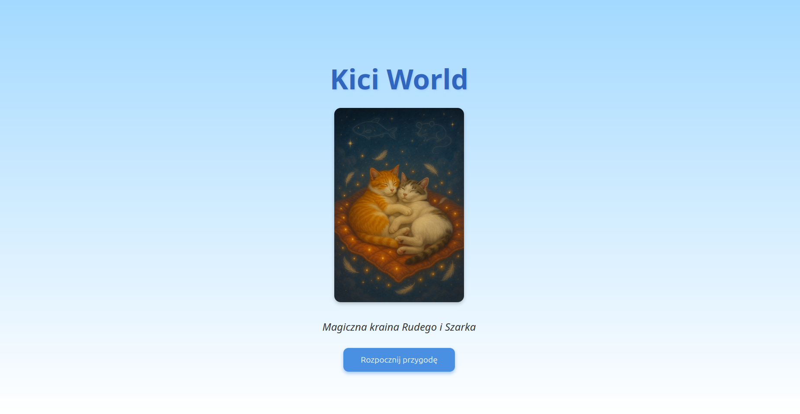
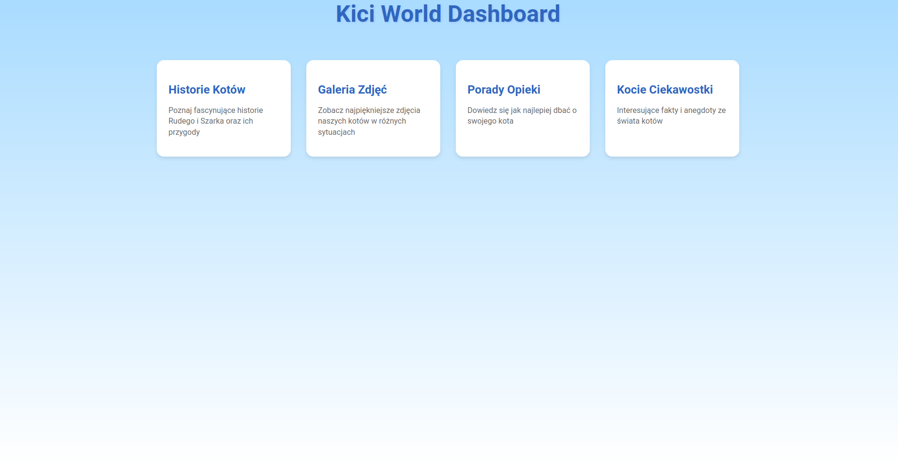
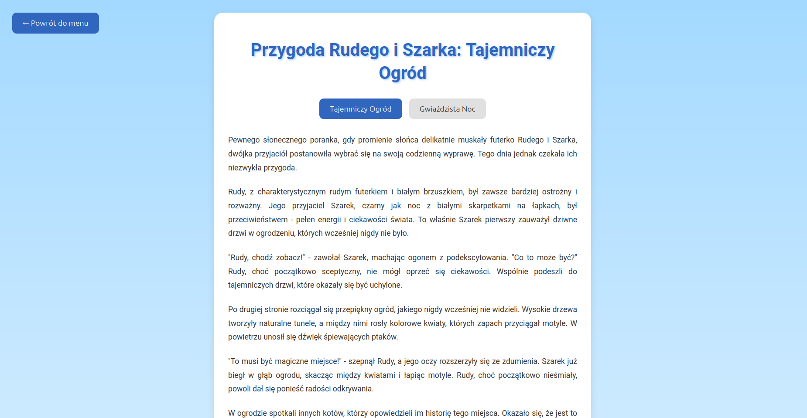
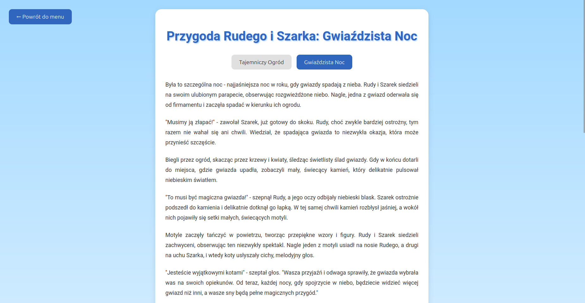
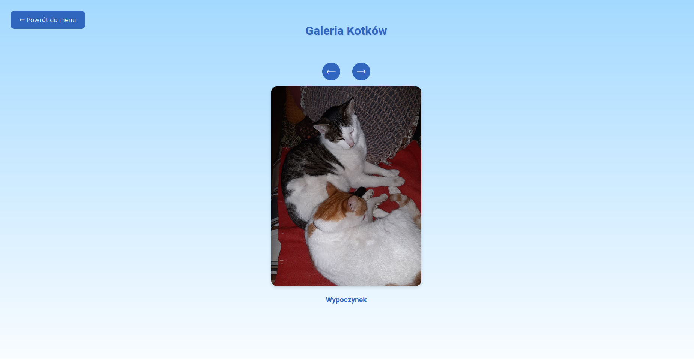
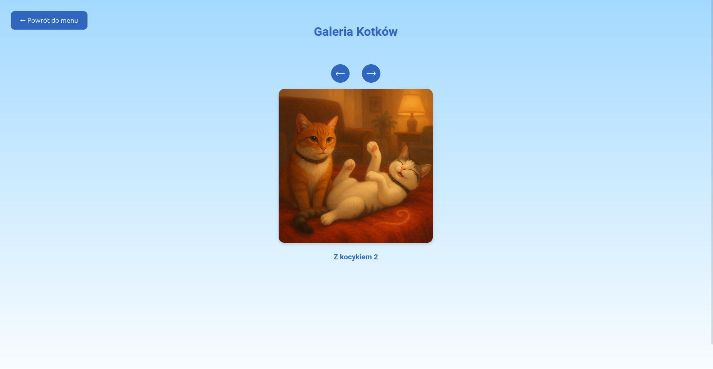
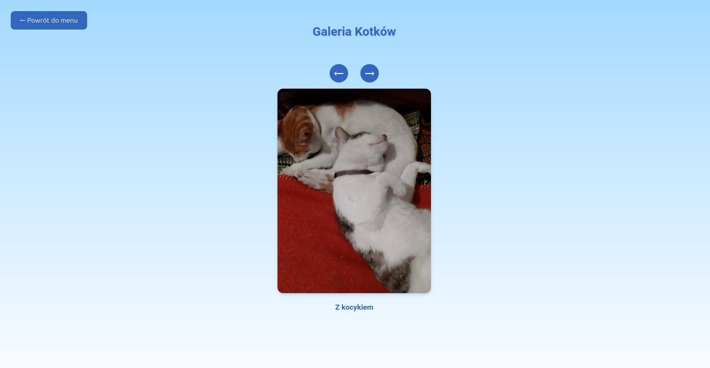
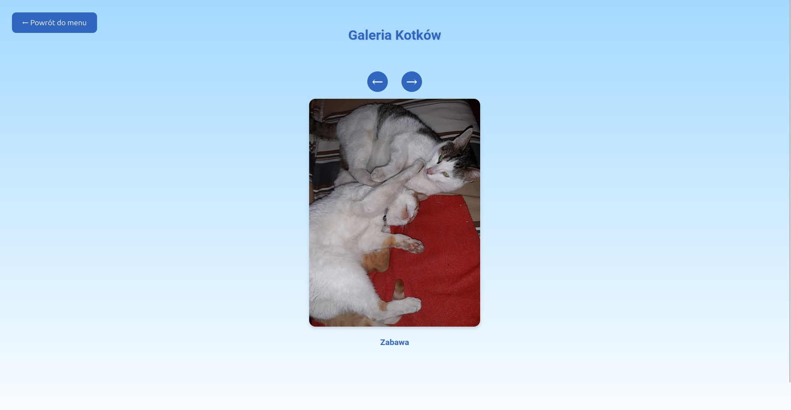
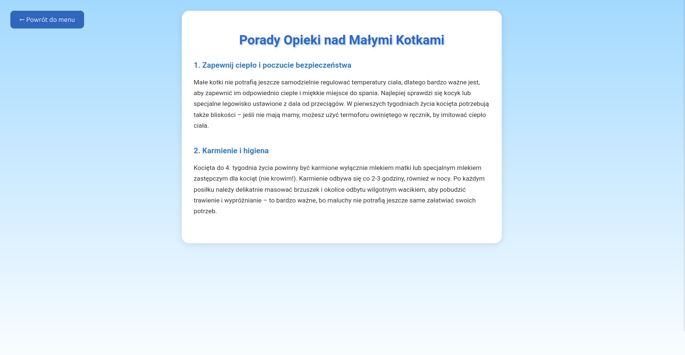
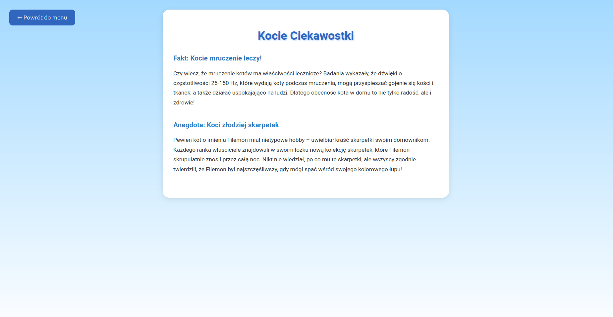

# 🐾 Kici World

**Demo online:** [https://kici-world.web.app/](https://kici-world.web.app/)

**Kici World** to nowoczesna, responsywna aplikacja webowa poświęcona kotom Rudy i Szarek. Projekt łączy elementy bajkowe, edukacyjne i praktyczne, prezentując historie, galerię zdjęć, porady opieki oraz ciekawostki o kotach.

---

## 🛠️ Technologie

- **React** (TypeScript) – główny framework do budowy interfejsu użytkownika
- **React Router** – obsługa routingu SPA
- **Styled-components** – stylowanie komponentów w JS/TS
- **Firebase Hosting** – hosting statyczny aplikacji
- **Node.js & npm** – zarządzanie zależnościami i skryptami

---

## 📦 Struktura projektu

```
├── public/           # pliki statyczne (w tym zdjęcia do galerii)
├── src/
│   ├── components/   # komponenty React (Dashboard, Galeria, Historie, Porady, Ciekawostki)
│   ├── App.tsx       # główny komponent z routingiem
│   └── ...
├── firebase.json     # konfiguracja Firebase Hosting (rewrites dla SPA)
├── package.json      # zależności i skrypty
└── README.md         # dokumentacja
```


## 🚀 Jak uruchomić lokalnie

1. Sklonuj repozytorium:
   ```bash
   git clone https://github.com/traininguniverse/cat-world.git
   cd cat-world   
   ```
2. Zainstaluj zależności:
   ```bash
   npm install
   ```
3. Uruchom aplikację:
   ```bash
   npm start
   ```
   Strona będzie dostępna pod [http://localhost:3000](http://localhost:3000)

---

## 🌐 Wdrażanie na Firebase Hosting

1. Zbuduj aplikację:
   ```bash
   npm run build
   ```
2. Wdróż na Firebase:
   ```bash
   firebase deploy
   ```

---

## ✨ Funkcjonalności

- **Strona główna** – powitanie i rozpoczęcie przygody
- **Dashboard** – menu główne z sekcjami:
  - **Historie Kotów** – bajkowe opowieści o Rudym i Szarku (podsekcje)
  - **Galeria** – slider ze zdjęciami kotków
  - **Porady Opieki** – praktyczne wskazówki dla opiekunów małych kotów
  - **Kocie Ciekawostki** – interesujące fakty i anegdoty

---

## 👨‍💻 Architektura i podejście

- Każda sekcja to osobny, wydzielony komponent React
- Routing oparty o React Router (`/dashboard`, `/gallery`, `/stories`, `/care`, `/facts`)
- Stylowanie komponentów z użyciem styled-components (CSS-in-JS)
- Obsługa SPA na Firebase Hosting dzięki rewrite do `index.html`
- Kod zgodny z TypeScript (typowanie propsów, komponentów)
- Prosta, czytelna struktura katalogów

---

## 🖼️ Zrzuty ekranu

Poniżej przykładowe widoki aplikacji:

### Strona główna


### Dashboard


### Historie Kotów



### Galeria (slider)





### Porady Opieki


### Kocie Ciekawostki


---

## 👥 Autorzy

- Training Universe (pomysł, kod, zdjęcia kotków)
- Rudy & Szarek (inspiracja, modele do zdjęć)

---

## 📄 Licencja

Projekt udostępniony na licencji Creative Commons Uznanie autorstwa-Użycie niekomercyjne 4.0 Międzynarodowa (CC BY-NC 4.0).
Szczegóły: https://creativecommons.org/licenses/by-nc/4.0/deed.pl

You are free to:
- Share — copy and redistribute the material in any medium or format
- Adapt — remix, transform, and build upon the material

Under the following terms:
- Attribution — You must give appropriate credit, provide a link to the license, and indicate if changes were made.
- NonCommercial — You may not use the material for commercial purposes.

No additional restrictions — You may not apply legal terms or technological measures that legally restrict others from doing anything the license permits.

---

**Miłego korzystania!** 